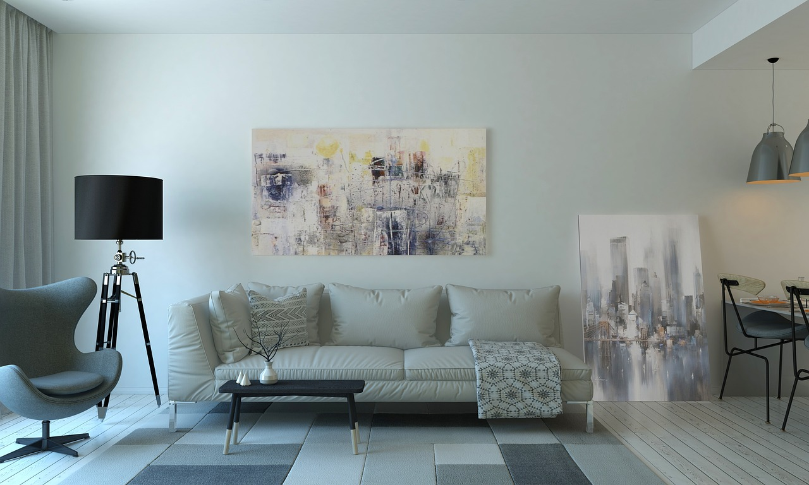

# 🏠 Solution Home — Modern Interior Design Webpage

A sleek, responsive static website for exploring modern home design ideas. Built with clean HTML and CSS, Solution Home provides a user-friendly showcase for interior inspiration, layout planning, and concept exploration.

---

## 🌐 Live Demo

- **Official Site (GitHub Pages):**  
  [https://navneetsscripts.github.io/solution-home-website/](https://navneetsscripts.github.io/solution-home-website/)  <!-- Replace with your actual link -->

- **Edit & Run Instantly (CodeSandbox):**  
  [https://codesandbox.io/p/sandbox/github/NavneetsScripts/solution-home-website](https://codesandbox.io/p/sandbox/github/NavneetsScripts/solution-home-website)

---

## 📸 Preview

---

## ✨ Features

- Modern, minimalist homepage with a bold banner and navigation menu
- Mobile-friendly and fully responsive layout
- Sections for Home, Bedroom, Dining, Kitchen, and Backyard
- Logo, background imagery, and animated call-to-action buttons
- Simple and lightweight—loads instantly

---

## 🚀 Getting Started

1. Clone the repository or download the source:
2. Open `index.html` in your browser.

No build tools or dependencies required!

---

## 🗂️ Project Structure

├── index.html

├── style.css

├── Logo.png

├── Background.jpg

---

## 👀 Customization

- Swap out images (`Logo.png`, `Background.jpg`) for your own branding and interior designs
- Edit navigation links and text in `index.html` as needed
- Modify styles in `style.css` for custom colors, fonts, or layouts

---

## 📖 Credits

- Developed by Navneet Kumar Sharma

---

> **Tags:** #HTML #CSS #StaticWebsite #WebDesign #Portfolio #ResponsiveDesign
